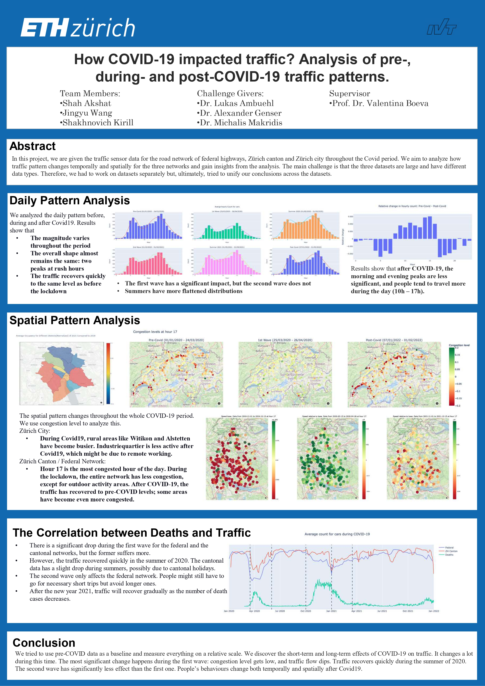

# ETHZ-DS-LAB-2023-Traffic
This is the project page for ETHz Data Science Lab 2023. We collaborated with [ETH IVT Group](https://www.ivt.ethz.ch/en/) and completed a detailed analysis on the traffic sensor data of the Swiss federal highway, Zurich canton and Zurich city. Due to data privacy, we are not able to publish the original dataset but we are allowed to publish our analysis report. In this repo you can find our conclusions as well as the drawing utilities we draw our figures (easy-to-use [plotly](https://github.com/plotly/plotly.py) plugin functions). You can also find the code for generating the figures in `report.ipynb` but you are not able to run it without the data.

**Team Members**
---
- Shah Akshat [akshah@student.ethz.ch](mailto:akshah@student.ethz.ch)
- Jingyu Wang [jingyuwang@student.ethz.ch](mailto:jingyuwang@student.ethz.ch)
- Shakhnovich Kirill [kirillsh@student.ethz.ch](mailto:kirillsh@student.ethz.ch)

## Introduction

Without any preprocesisng, we have three(four) data set:

**Canton**:

Canton data are saved in files in the format of 10 digits `iddate`, where id is the sensor id and date is of YYMMDD, eg. `1888210929`. It starts with a frontmatter contains metadata

```
* BEGIN
* FORMAT = VBV-1
* FORMATTER = GRFORMAT Release = 3.5.47
* INSTRUMENT = M680 Serial = 705172 Release = 2.9
* FILENAME = 
* SITE = 1888
* LOCATION = Moenchaltdorf
* GRIDREF = 
* HEADINGS =         
* STARTREC = 00:00 29/09/21
* STOPREC  = 00:00 30/09/21
* BATTERY = 6.90 6.90 
* SENSORS = LL LL NONE NONE NONE NONE NONE NONE 
* DATEFORM = DD/MM/YY
* UNITS = Metric
* PRUNITS = KPH-CM-10KG
* CLASS = SWISS10
```

Then the recorded data:

```
* SITE    HEAD   DDMMYY HHMM SS HH RESCOD  L D HEAD  GAP SPD LENTH    CS CH
    1888  000001 290921 0000 03 00 000000  2 1  3.0  3.0  49  1851     1  L
    1888  000002 290921 0000 35 00 000000  1 1 35.0 35.0  51   402     3  L
```

Each column means
```
SITE -- detector id
HEAD -- counter
DDMMYY -- day month year
HHMM -- time hour minutes
SS -- time seconds 
HH -- time 1/100s
RESCOD  -- na
L -- lane id (?)
D -- direction of travel (1= normal, 2= backward)
HEAD -- time gap (front bumper to front bumper)
GAP -- time gap (front bumper to back bumper)
SPD -- speed in km/h
LENTH -- vehicle length in cm
CS -- type of vehicle: 1= bus, 2= motorcycle, 3= car, 4= car with trailer, 5= delivery, 6= delivery with trailer, 7= delivery with long trailer, 8= truck, 9= long truck, 10= truck with trailer
CH -- height of a vehicle: very low, low, medium, high
```

**Astra**:

Astra data are saved in csv files in the format of `id_date.csv`, where id is the sensor id and the date is of YYYY-MM, eg. `20_2021-01.csv`. It contains the following information

```shell
 #   Column          Dtype          Remark
---  ------          -----          ------
 0   _id             object         event_id
 1   _class          object         
 2   src_time        object         event time
 3   src_time_src    int64 
 4   src_time_inc    int64 
 5   rcv_delay       int64          
 6   prot_type       int64 
 7   zs_id           int64          sensor_id
 8   vd              int64          lane_id (sensor_id+lane_id identifies one sensor)
 9   vd_seqnum_type  int64 
 10  vd_seqnum_val   int64 
 11  vd_status       int64 
 12  vd_class_type   int64 
 13  vd_class_val    int64          vehicle class
 14  vd_length_type  int64 
 15  vd_length_val   int64          vehicle length
 16  vd_dir          object
 17  vd_speed_type   int64 
 18  vd_speed_val    int64          vehicle speed
 19  vd_occ_type     int64 
 20  vd_occ_val      int64          occupancy
 21  vd_head_type    int64 
 22  vd_head_val     int64 
 23  vd_gap_type     int64 
 24  vd_gap_val      int64 
```

**City**:

City data are stored per year in csv files in the format of `Zurich_YYYY_raw2.csv`


```
#   Column       Dtype  
---  ------      -----  
 0   day         object 
 1   interval    int64  
 2   detid       object 
 3   flow        float64
 4   occ         float64
 5   valid       int64  
 6   suspect     int64
```

Annotation
```
interval = seconds from midnight
flow = flow per hour in the interval
occ = occupancy in percentage of time during which the detector was occupied (i.e. covered by a vehicle)
valid= the system classified the measurement as a valid one (without errors)
suspect= the system classified the measurement as suspicious (maybe an error)
```

Example:
```
          day  interval    detid      flow       occ  valid  suspect
0  2021-01-01       359  K126.D1  0.000000  0.000000      1        0
1  2021-01-01       539  K126.D1  2.941176  0.008987      1        0
2  2021-01-01       719  K126.D1  0.000000  0.000000      1        0
3  2021-01-01       899  K126.D1  0.000000  0.000000      1        0
4  2021-01-01      1079  K126.D1  0.000000  0.000000      1        0
```

And the corresponding **GIS data**:

**Canton**:

```
          detid                  geometry
0   canton_88_1  POINT (8.60388 47.41007)
1   canton_88_2  POINT (8.60369 47.41000)
2  canton_103_1  POINT (8.61135 47.33826)
3  canton_103_2  POINT (8.61124 47.33830)
4  canton_108_1  POINT (8.44618 47.26777)
```

**Astra**:

```
       detid                  geometry
0  astra_2_1  POINT (6.72462 46.57509)
1  astra_2_2  POINT (6.72462 46.57515)
2  astra_3_1  POINT (8.69818 46.10508)
3  astra_3_2  POINT (8.69823 46.10506)
4  astra_5_1  POINT (9.07607 47.00019)
```

**City**:

```
    detid type                  geometry
0  K2.D11  IMP  POINT (8.51846 47.37551)
1  K2.D13  IMP  POINT (8.51823 47.37519)
2  K2.D14  IMP  POINT (8.51875 47.37497)
3  K2.D15  IMP  POINT (8.51880 47.37487)
4  K2.D16  IMP  POINT (8.51884 47.37487)
```

## Conclusions

Please find our poster below to see our main conclusions.

